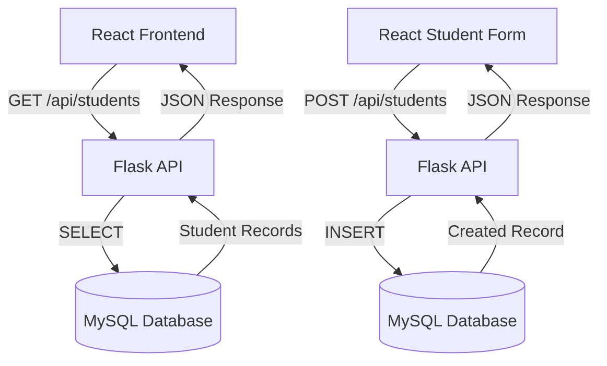

# Day 44 — Database Integration End-to-End

This project continues the Day 41–43 Student Management application and replaces the temporary in-memory Python student list with a real MySQL database.

## Project Overview

The application uses React for the frontend, Flask for the REST API/backend, and MySQL for persistent student data.

GET flow:

React → Flask API → MySQL SELECT → JSON → React UI

POST flow:

React Form → Flask API → MySQL INSERT → JSON → React UI

## Technology Stack

- React
- Vite
- Flask
- Flask-CORS
- MySQL
- mysql-connector-python
- python-dotenv
- JavaScript
- SQL

## Project Structure

day-44-react-flask-mysql/
├── backend/
│   ├── app.py
│   ├── requirements.txt
│   └── .env.example
├── database/
│   └── schema.sql
├── frontend/
│   ├── index.html
│   ├── package.json
│   ├── vite.config.js
│   └── src/
│       ├── App.jsx
│       ├── main.jsx
│       └── styles.css
├── .gitignore
└── README.md

## MySQL Database Setup

Make sure MySQL Server is installed and running.

Open MySQL Workbench or the MySQL command line and run the contents of:

database/schema.sql

The script creates:

- Database: `student_management`
- Table: `students`
- At least 5 sample records
- A UNIQUE constraint on email

To verify:

```sql
USE student_management;
SELECT * FROM students;
```

## Database Structure

| Column | Type | Constraints |
|---|---|---|
| id | INT | Primary Key, Auto Increment |
| name | VARCHAR(100) | NOT NULL |
| email | VARCHAR(150) | NOT NULL, UNIQUE |
| course | VARCHAR(100) | NOT NULL |

## Environment Configuration

Do not put your MySQL password directly in `app.py`.

Inside `backend`, copy `.env.example` to `.env` and update the values:

```env
DB_HOST=localhost
DB_USER=root
DB_PASSWORD=your_mysql_password
DB_NAME=student_management
```

The `.env` file is ignored by Git through `.gitignore`.

Never commit:

- `.env`
- MySQL passwords
- API keys
- Other secrets

## Install Backend Dependencies

Open a terminal:

```powershell
cd backend
python -m venv venv
```

Activate the virtual environment on Windows PowerShell:

```powershell
.\venv\Scripts\Activate.ps1
```

Install packages:

```powershell
python -m pip install -r requirements.txt
```

## Start Flask

With MySQL running and `.env` configured:

```powershell
python app.py
```

Flask runs at:

http://127.0.0.1:5000

## Install and Run React

Open a second terminal:

```powershell
cd frontend
npm install
npm run dev
```

React normally runs at:

http://localhost:5173

## API Endpoints

### GET /api/students

Returns all student records from MySQL.

Example:

```http
GET http://127.0.0.1:5000/api/students
```

Successful response:

```json
[
  {
    "id": 1,
    "name": "Arun Kumar",
    "email": "arun@example.com",
    "course": "AI & Data Science"
  }
]
```

### POST /api/students

Creates a student in MySQL.

Example JSON:

```json
{
  "name": "Afsin",
  "email": "afsin@gmail.com",
  "course": "AI & Data Science"
}
```

Successful response:

```json
{
  "success": true,
  "message": "Student created successfully",
  "student": {
    "id": 6,
    "name": "Afsin",
    "email": "afsin@gmail.com",
    "course": "AI & Data Science"
  }
}
```

## Frontend → Backend → MySQL Architecture



## Error Handling

The Flask backend handles:

- Database connection failures
- Invalid database operations
- Missing required fields
- Duplicate email addresses
- Database operation failures
- Unexpected backend errors

Example error response:

```json
{
  "success": false,
  "message": "Unable to save student"
}
```

Duplicate email response:

```json
{
  "success": false,
  "message": "Email already exists. Please use a different email."
}
```

The React frontend reads these JSON messages and displays them to the user.

## Data Persistence Verification

1. Add a new student through the React form.
2. Confirm the success message.
3. Open MySQL.
4. Run:

```sql
USE student_management;
SELECT * FROM students;
```

5. Confirm the new student is present.
6. Refresh the React application.
7. Confirm the student is loaded again from MySQL.

Unlike the earlier in-memory version, the data now persists after a page refresh and Flask restart, as long as the MySQL database remains available.

## Testing Checklist

- Start MySQL.
- Run `schema.sql`.
- Configure `backend/.env`.
- Start Flask.
- Start React.
- Verify GET `/api/students`.
- Add a student through React.
- Verify POST `/api/students`.
- Verify the new record directly in MySQL.
- Refresh React and confirm the record remains.
- Test duplicate email handling.
- Test missing required fields.
- Keep `.env` out of GitHub.
